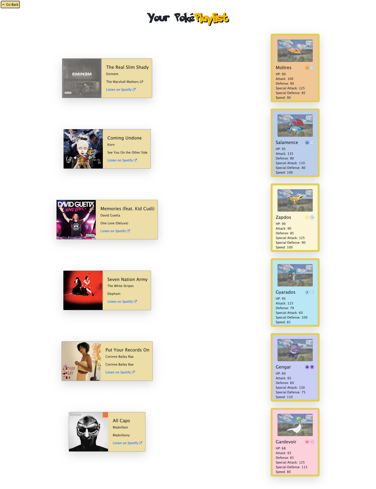

# Pok&eacute;Playlist App

## Description

Pok&eacute;Playlist is a website where you can create your ideal Pok&eacute;mon team and get a reccommended playlist based on your selection. You can use the search bar to find Pok&eacute;mon by name and add them to your team by dragging and dropping them in the sidebar. When you're satisfied, you can generate a playlist to see the reccommended songs based on each member of your team.

The project uses the <a href="https://pokeapi.co/docs/v2">PokeAPI</a> to get the name, image URL, types, and hp, defense, attack, special defense, special attack, and speed stats when the user searches for a Pok&eacute;mon. It then uses the received data to dynamically create a card for that Pok&eacute;mon in JavaScript. **_Add more?_**

**_Paragraph about the sidebar, drag & drop feature_**

When the user clicks the "Generate Pok&eacute;Playlist" button, it (**_info about storing data?_**) and opens a separate playlist.html page to display the team and playlist. The types and speed stat are used to create the search query corresponding to a particular Pok&eacute;mon to request info from the <a href="https://developer.spotify.com/documentation/web-api/reference/search">Spotify API</a>. If there are no access tokens stored or the stored tokens are expired, a request is made to Spotify to get a new token. The access token and the search query are sent to Spotify to do a search request for one song. The resulting song name, artist name, album name, album artwork URL, and Spotify URL are displayed next to the corresponding Pok&eacute;mon.

During this project, we learned a lot about API requests and authorization, as well as JSON formats and extracting data from objects. **_Anything else?_**

## Table of Contents

- [Installation](#installation)
- [Usage](#usage)
- [Credits](#credits)
- [License](#license)

## Installation

N/A

## Usage

You can access the website here: https://stms15.github.io/PokePlaylist-app/.

To use the site, just drag and drop any of the Pok&eacute;mon cards into "Your Team" in the sidebar, or search for any Pok&eacute;mon by name or number in the search bar. Elligible Pok&eacute;mon names that match the search input will display in a dropdown.

**_Add photo_**

**_Add more info_**

Spotify will return a song for each Pok&eacute;mon in the team based on specified search criteria that corresponds to each species' primary typing and speed stat. The playlist will be created on open of the Playlist page/ on click of the "Generate Pok&eacute;Playlist" button. This may take a moment to load.

## Credits

**Collaborators:**

- Lex Rayne (https://github.com/lexrayne)
- Skyler Keeling (https://github.com/skylerkeeling)

Because the fetch requests for Spotify were built inside functions, the browser wasn't waiting for a response from the API request before continuing to execute the code. To fix this, https://rapidapi.com/guides/fetch-api-async-await was referenced to turn these functions into "async" functions so that the browser would wait for a response before continuing.

The font package for the "Pok&eacute;Playlist" header was obtained here: https://www.dafont.com/pokemon.font. Another <a href="https://fontmeme.com/fonts/pokmon-font/" target="_blank">font website</a> has some license information and indicated that the font was available for personal use. The site <a href="https://www.geeksforgeeks.org/how-to-include-a-font-ttf-using-css/" target="_blank">How to Include a Font ttf Using CSS</a> provided helpful tips on how to properly use and incorporiate the font files.

To get the external link icon that indicates the link will open in a new window, the site https://www.w3schools.com/icons/tryit.asp?filename=tryicons_fa-external-link was used as reference.

On the playlist.html page, the background colour of the "Go Back" button fills from left to right on hover. The site https://stackoverflow.com/questions/17212094/fill-background-color-left-to-right-css helped understand how to acheive this.

This Stack Overflow thread explained how to limit the size of the autocomplete dropdown for the search input on the main page: https://stackoverflow.com/questions/7617373/limit-results-in-jquery-ui-autocomplete.

The type icons were created in Figma using the Material Design Icons library.

**_Any other credits?_**

## License

MIT

See the LICENSE file for more details.

---

## Badges

## Features

1. Spotify API Integration

Work completed on this branch includes a JavaScript function to first request an access token from Spotify using client credentials, and a function to search Spotify using the access token and passed in search query.

2. PokeAPI Integration

**_add branch info_**

3. Sidebar & Drag and Drop

**_add branch info_**

4. Displaying Team and Playlist

On this branch, a separate html page was created to display the users finalized team and the playlist generated by searching Spotify. An additional javascript file was also introduced to house code specific to the playlist.html page. The Spotify API functions were moved from the main js file to the new file, and some functions to display the Pok&eacute;mon cards were copied to use on both pages. Also including is some css styling for each song in the playlist.

**_Any other features?_**
